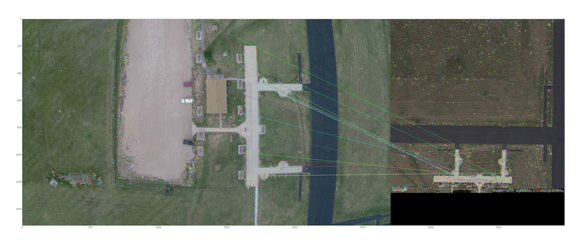

# VisualNavigation
Visual Navigation Project based on Google Map using OpenCV and GPU 

### Instruction

The main scripts on CPU side includes the following:

- process_video_file.py

- generate_grid.py

- generate_image_keypoints.py

- generate_all_image_keypoints.py

- generate_keypoint_gps.py

- match_flight_to_grid_keypoints.py

- find_best_matches.py

- navigation.py

- error_handle.py

- heatmap_tracker.py

- static_matches_plot.py

  where the navigation.py is the main script that's able to run other scripts in order.

#### Improvment on Performance

We've taken several approaches to decrease the run time of our program.

- Integrated with OpenCV GPU module, which is written in CUDA, in keypoints extraction and matching stages.

- Instead of matching one flight image with all the database maps each time, matching one flight image with 8 adjacent maps of the best matched map previously.

- Instead of storing immediate results to a .json file at each stage, taking the result of each previous stage as the input for the next stage. 

#### Output

A frame of video matching with the map in database:

Other results:

- An Analysis of running performance.

- A mp4 file that animates the results of matching a test flight video with the corresponding google database maps. 

#### Current Issue

- Involve performing image processing on the database and flight images to normalize the comparison.

